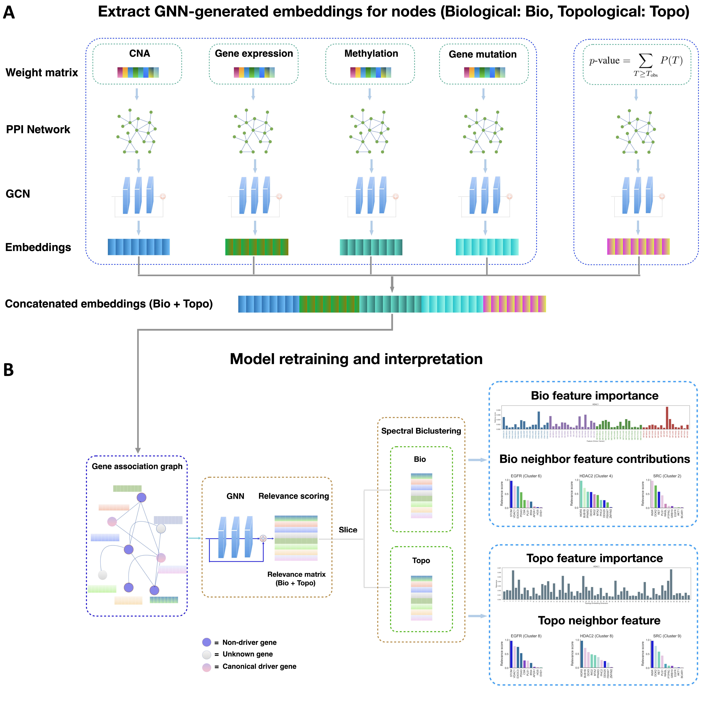

# SGL-CDP: Spectral Graph Learning for Cancer Driver Prioritization

This repository contains the source code and data resources for our project:

**SGL-CDP: Spectral Graph Learning for Cancer Driver Prioritization**

<p align="center">
  
</p>

---

## Overview

SGL-CDP is a graph learning framework for **cancer driver gene prioritization** based on spectral graph learning and biological interaction networks.

The repository provides the implementation and resources required for:

* Gene network pretraining
* Graph-based gene representation learning
* Cancer driver gene prediction
* Multi-omics gene association analysis

---

## Data Sources

The datasets used in this project are obtained from the following publicly available resources:

### STRING

**STRING — Search Tool for the Retrieval of Interacting Genes/Proteins**

[STRING Database](https://string-db.org/cgi/download?sessionId=b7WYyccF6G1p&utm_source=chatgpt.com)

STRING provides protein-protein interaction and functional association data used to construct gene/protein interaction networks.

### HIPPIE

**HIPPIE — Human Integrated Protein-Protein Interaction rEference**

[HIPPIE Database](https://cbdm-01.zdv.uni-mainz.de/~mschaefer/hippie/download.php?utm_source=chatgpt.com)

HIPPIE provides experimentally supported and computationally integrated human protein-protein interaction data.

### ConsensusPathDB

**ConsensusPathDB (CPDB)**

[ConsensusPathDB](http://cpdb.molgen.mpg.de/CPDB?utm_source=chatgpt.com)

ConsensusPathDB integrates molecular interaction and pathway information from multiple biological databases.

Together, these resources provide curated and integrated **protein-protein interaction (PPI)** and **pathway** information for constructing biological networks used in this project.

---

## Requirements

The implementation is based on Python, PyTorch, and Deep Graph Library (DGL).

### 1. Install the required dependencies

Clone the repository and install the packages listed in `requirements.txt`:

```bash
pip install -r requirements.txt
```

### 2. Activate the Conda environment

```bash
conda activate gnn
```

### 3. Install PyTorch

```bash
conda install pytorch torchvision torchaudio -c pytorch
```

### 4. Install additional Python packages

```bash
pip install pandas
pip install py2neo pandas matplotlib scikit-learn
pip install tqdm
pip install seaborn
```

### 5. Install DGL

```bash
conda install -c dglteam dgl
```

---

## Getting Started

The workflow consists of two main stages:

1. **Gene network pretraining**
2. **Cancer driver gene prediction**

---

## 1. Gene Network Pretraining

For pretraining, download the pre-built **BRCA gene network** and place the downloaded file in:

```text
data/processed/omics_per_cancer/
```

### Download Gene Network

[Download Gene Network](https://drive.google.com/file/d/1L49jx0wrQ5Xu-ryICWkgGJ1TJgwTD_dU/view?usp=sharing)

After downloading and placing the network in the specified directory, run:

```bash
python gnn_embedding/gat_embedding.py \
    --model_type GAT \
    --out_feats 32 \
    --num_layers 2 \
    --num_heads 1 \
    --batch_size 1 \
    --lr 0.0001 \
    --num_epochs 200
```

### Pretraining Parameters

| Parameter                 |  Value |
| ------------------------- | -----: |
| Model                     |    GAT |
| Output features           |     32 |
| Number of layers          |      2 |
| Number of attention heads |      1 |
| Batch size                |      1 |
| Learning rate             | 0.0001 |
| Number of epochs          |    200 |

The pretrained gene representations can subsequently be used for downstream cancer driver gene prediction.

---

## 2. Cancer Driver Gene Prediction

For prediction, download the data generated from the **built gene association graph** and place it in:

```text
data/multiomics_meth/
```

### Download Gene Association Data

[Download Gene Association Data](https://drive.google.com/file/d/1l7mbTn2Nxsbc7LLLJzsT8y02scD23aWo/view?usp=sharing)

After downloading and placing the data in the specified directory, run:

```bash
python main.py \
    --model_type ACGNN \
    --net_type CPDB \
    --score_threshold 0.99 \
    --learning_rate 0.001 \
    --num_epochs 200
```

### Prediction Parameters

| Parameter        | Value |
| ---------------- | ----: |
| Model            | ACGNN |
| Network type     |  CPDB |
| Score threshold  |  0.99 |
| Learning rate    | 0.001 |
| Number of epochs |   200 |

---

## Repository Workflow

The overall workflow can be summarized as:

```text
Biological Data Sources
        │
        ├── STRING
        ├── HIPPIE
        └── ConsensusPathDB
                │
                ▼
        Gene Association Networks
                │
                ▼
       Gene Network Pretraining
                │
                ▼
       Spectral Graph Learning
                │
                ▼
      Learned Gene Representations
                │
                ▼
    Cancer Driver Gene Prediction
                │
                ▼
       Candidate Driver Genes
```

---

## Citation

If you find this project useful for your research, please cite the following work:

```bibtex
@misc{LiMaSSRN2026Chebyshev,
  author       = {Li, Sa and Ma, Tianle},
  title        = {Learning Interpretable Gene Representations with Adaptive Chebyshev Graph Neural Networks},
  year         = {2026},
  publisher    = {SSRN},
  doi          = {10.2139/ssrn.6382922},
  url          = {https://ssrn.com/abstract=6382922},
  note         = {Available at SSRN}
}
```

---

## Acknowledgements

We acknowledge the developers and maintainers of the following resources for providing the biological interaction and pathway data used in this project:

* [STRING](https://string-db.org/)
* [HIPPIE](https://cbdm-01.zdv.uni-mainz.de/~mschaefer/hippie/download.php)
* [ConsensusPathDB](http://cpdb.molgen.mpg.de/CPDB)

We also acknowledge the open-source communities behind **PyTorch**, **DGL**, **scikit-learn**, **pandas**, **Matplotlib**, **Seaborn**, and **tqdm**.

---

## License

Please refer to the repository for the applicable license and terms of use.
